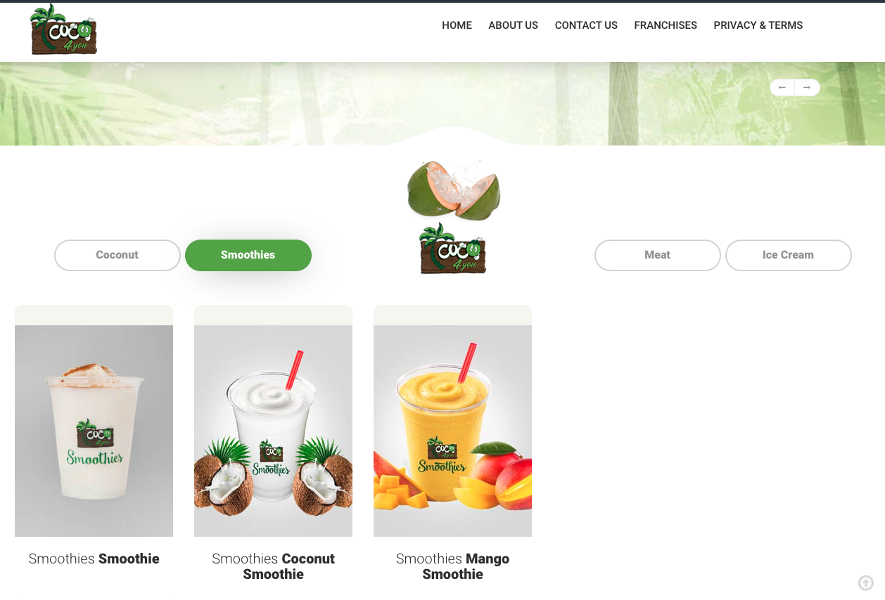
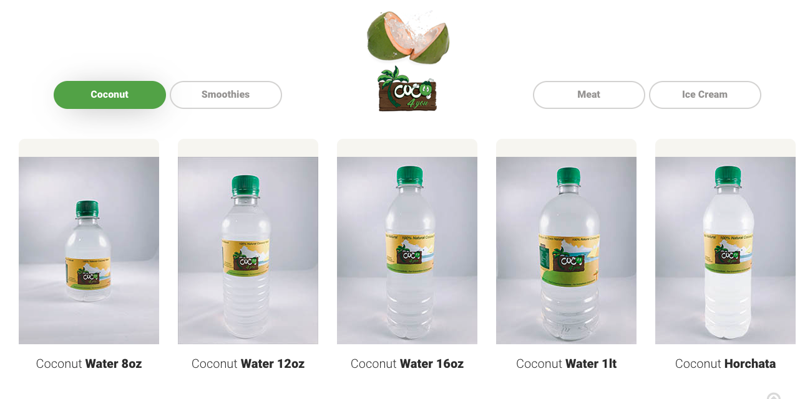

# Welcome to coco4you website 2016 👋

Track your daily expenses and income with this simple app.

the package of this project was update in 2024 to make it more secure and stable with NodeJs v20.
## Get started

1. Install dependencies

   ```bash
   npm install
   ```

2. Start the coco 4 you website

   ```bash
    npm start
   ```
3. Open browser and navigate to `http://localhost:3000`

## Welcome Page


## Smoothies Page



## Coconut Page




## Information Page


## About Page


## About Page


