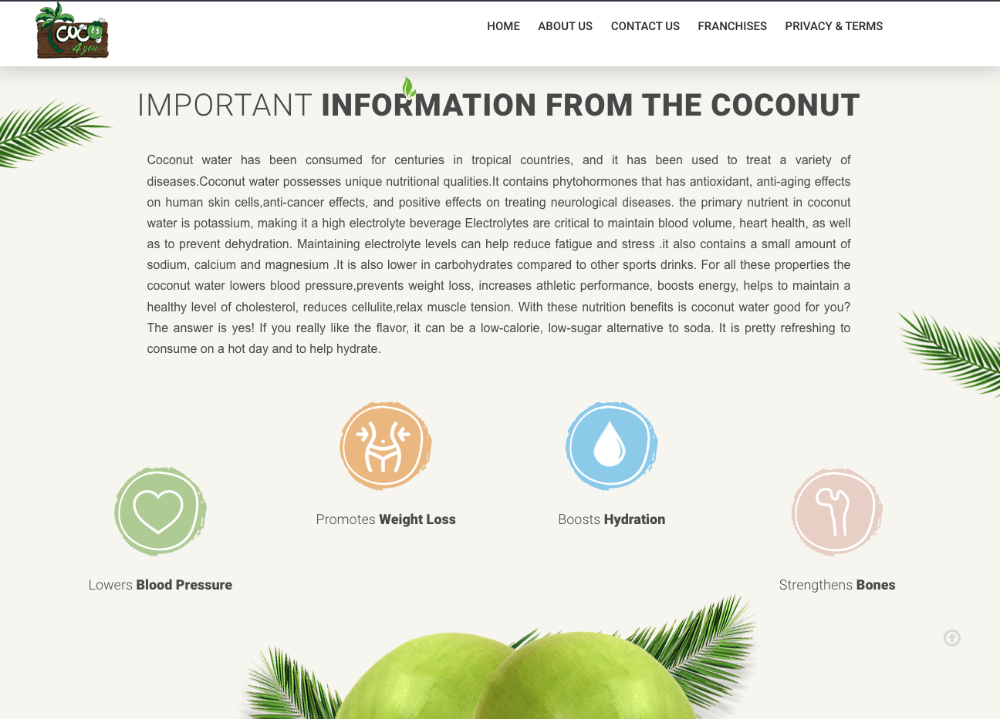

# Welcome to coco4you website 👋

Track your daily expenses and income with this simple app.

## Get started

1. Install dependencies

   ```bash
   npm install
   ```

2. Start the coco 4 you website

   ```bash
    npm start
   ```
3. Open browser and navigate to `http://localhost:3000`

## Welcome Page


## Smoothies Page


## Coconut Page


## Information Page



## About Page


## About Page


